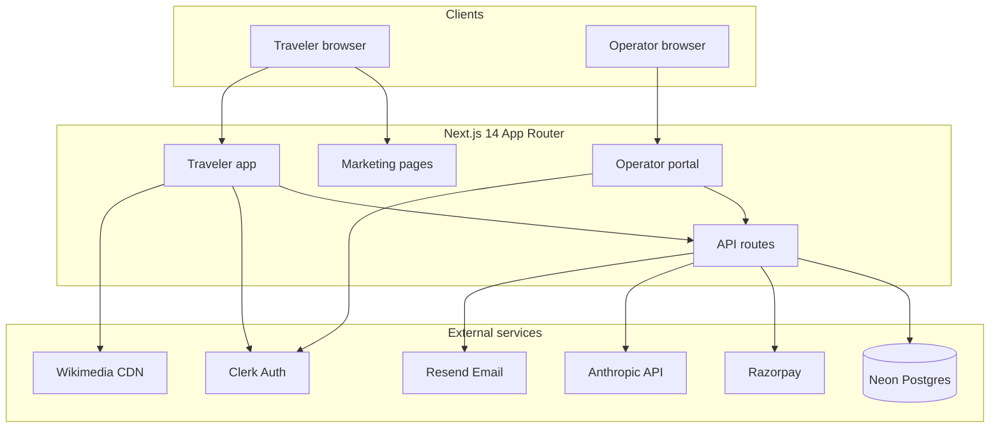
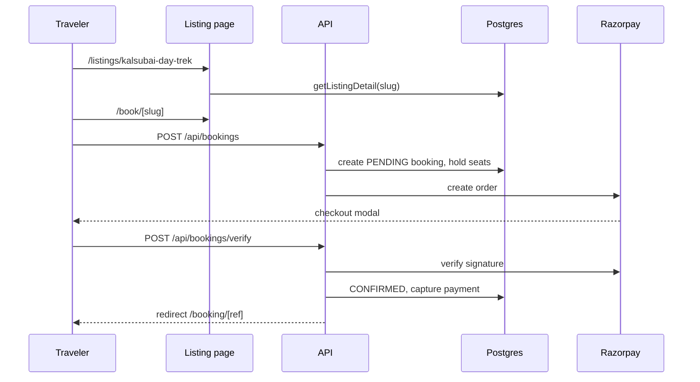
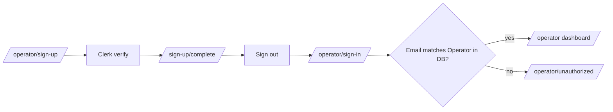

# Bhraman - Architecture

System design for the TrailsMate / Bhraman adventure marketplace.

---

## High-level overview



---

## Application layers

### 1. Presentation (`src/app/`, `src/components/`)

| Route group        | Purpose                                     | Auth                  |
| ------------------ | ------------------------------------------- | --------------------- |
| `(marketing)`      | SEO landing, about, operator recruitment    | Public                |
| `(app)`            | Discovery, listing detail, booking, planner | Partial (bookings)    |
| `operator/`        | Dashboard, CRUD, payouts                    | Clerk + operator role |
| `operators/[slug]` | Public operator trust portfolio             | Public                |
| `admin/`           | Escrow dispute operations                   | Clerk + ADMIN role    |
| `api/`             | Serverless handlers                         | Session / secrets     |

UI is server-rendered where possible; client components for booking checkout, gallery scroll, planner chat, operator forms.

### 2. Domain logic (`src/lib/`)

| Module               | Responsibility                                           |
| -------------------- | -------------------------------------------------------- |
| `listings.ts`        | Query listings from DB; fallback to `seed-catalog.ts`    |
| `listing-images.ts`  | Map listing slug → hero + gallery (Wikimedia)            |
| `auth.ts`            | Clerk sync, traveler/operator sessions, ownership checks |
| `booking.ts`         | Create booking, hold seats, pricing                      |
| `razorpay.ts`        | Order creation, signature verification                   |
| `anthropic.ts`       | Planner tool-calling + listing search                    |
| `operator.ts`        | Dashboard aggregates, operator CRUD helpers              |
| `weather.ts`         | Open-Meteo signal for listing coordinates                |
| `operator-emails.ts` | Clerk-compatible operator email mapping                  |

### 3. Data (`prisma/`)

**ORM:** Prisma 6 on PostgreSQL.

**Core relationships:**

```
User 1──1 Operator
User 1──* Booking
Place 1──* Listing
Listing *──1 Category
Listing *──1 Operator
Listing 1──* AvailabilitySlot
Listing 1──* ItineraryStep
Booking *──1 Payment
Booking 1──0..1 Review
Operator 1──* Payout
Payment 1──0..1 Payout
```

**Listing media:** `heroImageUrl` (cover) + `galleryUrls[]` (additional photos, not duplicated in hero).

---

## Request flows

### Discover → book



### Operator auth



`syncUserFromClerk()` links Clerk `userId` to `User` by email. Operator access requires `User.role = OPERATOR` and an `Operator` row.

**Middleware** (`src/middleware.ts`): Clerk `protect()` on `/bookings/*`, `/booking/*`, and `/operator/*` except sign-in, sign-up, unauthorized.

---

## API surface

### Public / traveler

| Method | Path                                | Purpose                                   |
| ------ | ----------------------------------- | ----------------------------------------- |
| GET    | `/api/listings/[slug]/availability` | Open slots                                |
| POST   | `/api/bookings`                     | Create booking + Razorpay order           |
| POST   | `/api/bookings/verify`              | Confirm payment                           |
| POST   | `/api/planner`                      | AI listing search                         |
| POST   | `/api/webhooks/razorpay`            | Payment webhook                           |
| GET    | `/api/cron/release-escrow`          | Release held escrow after trip completion |
| POST   | `/api/bookings/[id]/dispute`        | Traveler escrow dispute                   |

### Operator (authenticated)

| Method       | Path                                  | Purpose                         |
| ------------ | ------------------------------------- | ------------------------------- |
| GET/POST     | `/api/operator/listings`              | List / create                   |
| PATCH/DELETE | `/api/operator/listings/[id]`         | Update / delete own             |
| GET/POST     | `/api/operator/availability`          | Slot management                 |
| PATCH        | `/api/operator/bookings/[id]`         | Status updates                  |
| PATCH        | `/api/operator/payouts/[id]`          | Reject operator self-settlement |
| POST         | `/api/operator/bookings/[id]/dispute` | Operator escrow dispute         |
| PATCH        | `/api/admin/disputes/[id]`            | Admin release/refund resolution |

### Cron

| Method | Path                      | Purpose                                              |
| ------ | ------------------------- | ---------------------------------------------------- |
| GET    | `/api/cron/release-seats` | Sync unpaid holds then release seats (`CRON_SECRET`) |

---

## Data pipeline

### Seed (one-time / refresh)

```
prisma/data/seed-data.json
        ↓
   prisma/seed.ts  (upsert by slug - safe to re-run)
        ↓
   Neon Postgres
```

### Images

```
prisma/data/place-images.json  (Wikimedia URLs per place)
        ↓
src/lib/listing-images.ts      (listing slug → hero + gallery)
        ↓
prisma/attach-listing-images.ts  (npm run db:images)
        ↓
Listing.heroImageUrl, Listing.galleryUrls
```

### Catalog fallback

If DB has no published listings, `seed-catalog.ts` reads JSON directly so the UI works offline from seed files.

---

## Frontend architecture

### Listing detail composition

1. **Hero** - full-width `heroImageUrl` with title overlay
2. **Description** - summary + long text
3. **Gallery strip** - `galleryUrls` only; horizontal scroll + lightbox
4. **Itinerary** - animated timeline
5. **Sidebar** - weather widget + sticky booking panel

### Discover cards

Hero background, category/difficulty badges, photo count, hover peek of second gallery image.

---

## Security model

| Concern             | Approach                                                                    |
| ------------------- | --------------------------------------------------------------------------- |
| Traveler sessions   | Clerk JWT; `getSessionTraveler()`                                           |
| Operator sessions   | Clerk + DB role check; `requireSessionOperator()`                           |
| Admin sessions      | Clerk + `User.role = ADMIN`; server-side route gate                         |
| Listing ownership   | `assertOwnsListing(userId, listingId)`                                      |
| Booking ownership   | `assertOwnsBookingRef(userId, ref)`                                         |
| Webhooks            | Razorpay HMAC verification                                                  |
| Escrow              | Captured payments stay `HELD` until trip completion + dispute window        |
| Sensitive trip data | Emergency/medical fields selected only on owned trip-roster route           |
| Cron                | Both cron routes require `CRON_SECRET`; fail closed if missing              |
| Secrets             | `.env` gitignored; never in client bundle except public Clerk/Razorpay keys |

---

## Deployment topology

```
Vercel (Next.js)
  ├── Server Components + API routes
  ├── Edge middleware (Clerk)
  └── Static assets (public/)

Neon Postgres (serverless)
  └── Pooled connection string in production

Clerk (auth)
Razorpay (payments)
Anthropic (planner)
Resend (transactional email)
```

**Build:** `prisma generate && next build` (see `package.json`).
**Schema changes:** committed Prisma migrations under `prisma/migrations/`.

---

## Key design decisions

1. **JSON seed + DB** - rich dataset in git; Postgres for production queries and bookings
2. **Separate operator portal** - distinct Clerk paths, role gate in layout, unauthorized page prevents redirect loops
3. **Payment verify + webhook** - client verify for instant UX; webhook as backup
4. **Place-level images** - one Wikimedia pool per place; rotated hero for multi-listing places
5. **No full reseed for email fixes** - `db:operators` script updates operator emails only

---

## Related docs

- [`README.md`](README.md) - setup and usage
- [`.env.example`](.env.example) - environment variables
